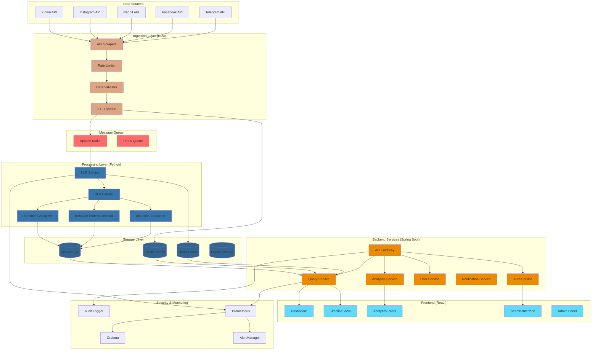
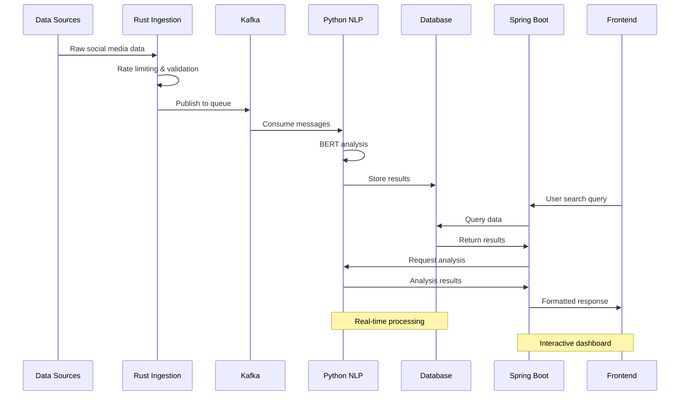
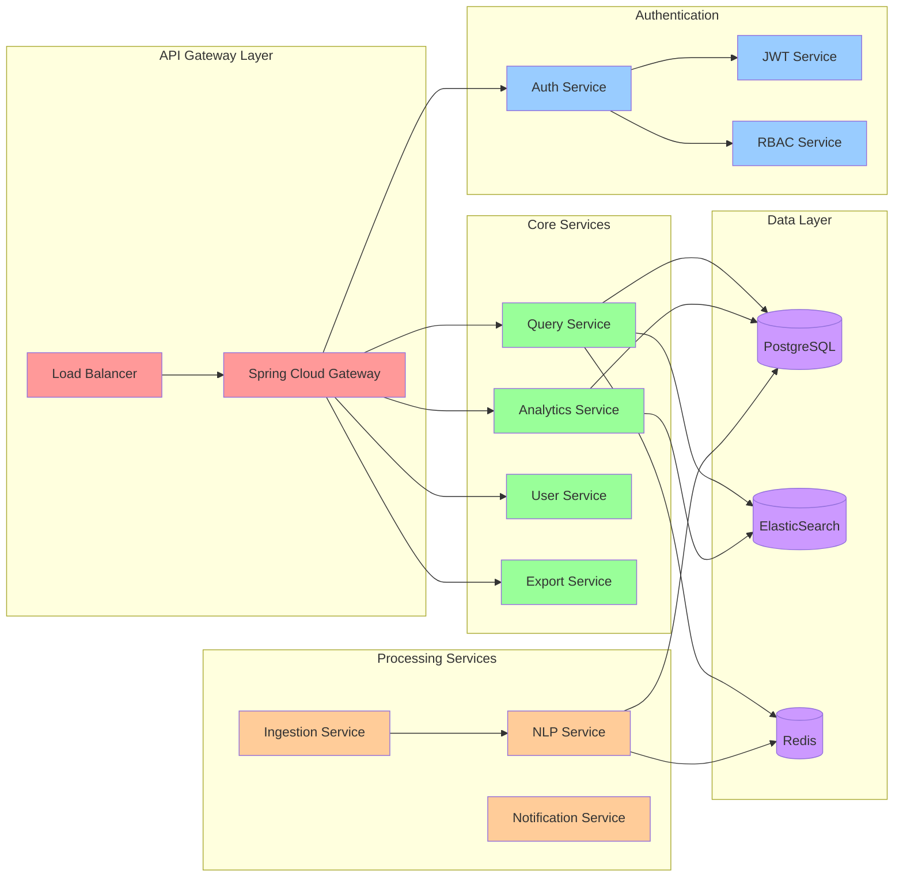
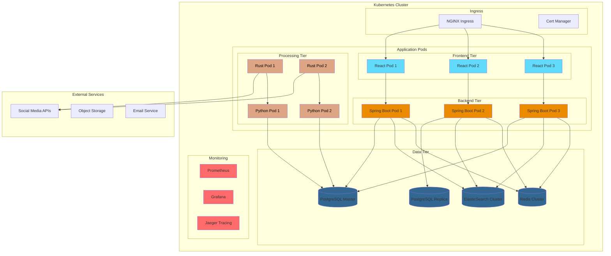

# SentinelBERT System Architecture Diagrams

## High-Level System Architecture

## Data Processing Pipeline

## Microservices Architecture

## Deployment Architecture

## Security Architecture

```mermaid
graph TB
    subgraph "External Access"
        USER[Investigators]
        ADMIN[System Admins]
    end

    subgraph "Security Perimeter"
        WAF[Web Application Firewall]
        DDoS[DDoS Protection]
        RATE_LIMIT[Rate Limiting]
    end

    subgraph "Authentication Layer"
        SSO[Single Sign-On]
        MFA[Multi-Factor Auth]
        JWT_SERVICE[JWT Service]
    end

    subgraph "Authorization Layer"
        RBAC_SERVICE[RBAC Service]
        POLICY_ENGINE[Policy Engine]
        AUDIT_SERVICE[Audit Service]
    end

    subgraph "Application Security"
        INPUT_VALIDATION[Input Validation]
        OUTPUT_ENCODING[Output Encoding]
        CSRF_PROTECTION[CSRF Protection]
        XSS_PROTECTION[XSS Protection]
    end

    subgraph "Data Security"
        ENCRYPTION_AT_REST[Encryption at Rest]
        ENCRYPTION_IN_TRANSIT[Encryption in Transit]
        DATA_MASKING[Data Masking]
        KEY_MANAGEMENT[Key Management]
    end

    subgraph "Network Security"
        VPC[Virtual Private Cloud]
        NETWORK_SEGMENTATION[Network Segmentation]
        FIREWALL_RULES[Firewall Rules]
        VPN[VPN Access]
    end

    subgraph "Monitoring & Compliance"
        SIEM[SIEM System]
        LOG_AGGREGATION[Log Aggregation]
        COMPLIANCE_REPORTING[Compliance Reporting]
        THREAT_DETECTION[Threat Detection]
    end

    USER --> WAF
    ADMIN --> WAF
    WAF --> DDoS
    DDoS --> RATE_LIMIT
    RATE_LIMIT --> SSO
    SSO --> MFA
    MFA --> JWT_SERVICE
    JWT_SERVICE --> RBAC_SERVICE
    RBAC_SERVICE --> POLICY_ENGINE
    POLICY_ENGINE --> AUDIT_SERVICE

    AUDIT_SERVICE --> INPUT_VALIDATION
    INPUT_VALIDATION --> OUTPUT_ENCODING
    OUTPUT_ENCODING --> CSRF_PROTECTION
    CSRF_PROTECTION --> XSS_PROTECTION

    XSS_PROTECTION --> ENCRYPTION_AT_REST
    ENCRYPTION_AT_REST --> ENCRYPTION_IN_TRANSIT
    ENCRYPTION_IN_TRANSIT --> DATA_MASKING
    DATA_MASKING --> KEY_MANAGEMENT

    KEY_MANAGEMENT --> VPC
    VPC --> NETWORK_SEGMENTATION
    NETWORK_SEGMENTATION --> FIREWALL_RULES
    FIREWALL_RULES --> VPN

    VPN --> SIEM
    SIEM --> LOG_AGGREGATION
    LOG_AGGREGATION --> COMPLIANCE_REPORTING
    COMPLIANCE_REPORTING --> THREAT_DETECTION

    classDef security fill:#ff6b6b
    classDef auth fill:#4ecdc4
    classDef data fill:#45b7d1
    classDef network fill:#96ceb4
    classDef monitoring fill:#feca57

    class WAF,DDoS,RATE_LIMIT security
    class SSO,MFA,JWT_SERVICE,RBAC_SERVICE,POLICY_ENGINE auth
    class ENCRYPTION_AT_REST,ENCRYPTION_IN_TRANSIT,DATA_MASKING,KEY_MANAGEMENT data
    class VPC,NETWORK_SEGMENTATION,FIREWALL_RULES,VPN network
    class SIEM,LOG_AGGREGATION,COMPLIANCE_REPORTING,THREAT_DETECTION monitoring
```

## ML/NLP Pipeline Architecture

```mermaid
graph LR
    subgraph "Data Preprocessing"
        TEXT_CLEAN[Text Cleaning]
        TOKENIZATION[Tokenization]
        NORMALIZATION[Normalization]
    end

    subgraph "Feature Extraction"
        BERT_EMBEDDINGS[BERT Embeddings]
        USER_FEATURES[User Features]
        TEMPORAL_FEATURES[Temporal Features]
        NETWORK_FEATURES[Network Features]
    end

    subgraph "Model Ensemble"
        SENTIMENT_MODEL[Sentiment Model]
        BEHAVIOR_MODEL[Behavior Model]
        INFLUENCE_MODEL[Influence Model]
        TREND_MODEL[Trend Model]
    end

    subgraph "Post-Processing"
        SCORE_AGGREGATION[Score Aggregation]
        CONFIDENCE_CALCULATION[Confidence Calculation]
        RESULT_VALIDATION[Result Validation]
    end

    subgraph "Model Serving"
        MODEL_CACHE[Model Cache]
        BATCH_INFERENCE[Batch Inference]
        REAL_TIME_INFERENCE[Real-time Inference]
        A_B_TESTING[A/B Testing]
    end

    TEXT_CLEAN --> TOKENIZATION
    TOKENIZATION --> NORMALIZATION
    NORMALIZATION --> BERT_EMBEDDINGS

    BERT_EMBEDDINGS --> SENTIMENT_MODEL
    USER_FEATURES --> BEHAVIOR_MODEL
    TEMPORAL_FEATURES --> INFLUENCE_MODEL
    NETWORK_FEATURES --> TREND_MODEL

    SENTIMENT_MODEL --> SCORE_AGGREGATION
    BEHAVIOR_MODEL --> SCORE_AGGREGATION
    INFLUENCE_MODEL --> SCORE_AGGREGATION
    TREND_MODEL --> SCORE_AGGREGATION

    SCORE_AGGREGATION --> CONFIDENCE_CALCULATION
    CONFIDENCE_CALCULATION --> RESULT_VALIDATION

    RESULT_VALIDATION --> MODEL_CACHE
    MODEL_CACHE --> BATCH_INFERENCE
    MODEL_CACHE --> REAL_TIME_INFERENCE
    MODEL_CACHE --> A_B_TESTING

    classDef preprocessing fill:#ffd93d
    classDef features fill:#6bcf7f
    classDef models fill:#4d96ff
    classDef postprocessing fill:#ff6b6b
    classDef serving fill:#a8e6cf

    class TEXT_CLEAN,TOKENIZATION,NORMALIZATION preprocessing
    class BERT_EMBEDDINGS,USER_FEATURES,TEMPORAL_FEATURES,NETWORK_FEATURES features
    class SENTIMENT_MODEL,BEHAVIOR_MODEL,INFLUENCE_MODEL,TREND_MODEL models
    class SCORE_AGGREGATION,CONFIDENCE_CALCULATION,RESULT_VALIDATION postprocessing
    class MODEL_CACHE,BATCH_INFERENCE,REAL_TIME_INFERENCE,A_B_TESTING serving
```

