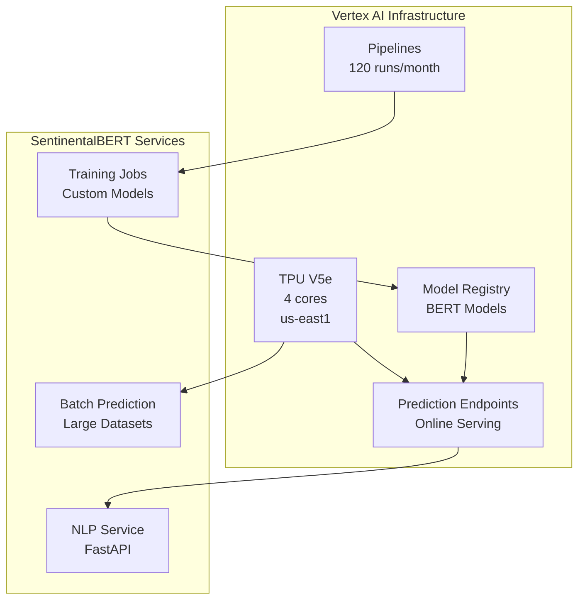

# Vertex AI Setup Guide for SentinentalBERT

<div align="center">


**High-Performance ML Infrastructure with TPU V5e Acceleration**

</div>

---

## 📋 Table of Contents

- [🎯 Overview](#-overview)
- [🔧 Prerequisites](#-prerequisites)
- [🚀 TPU V5e Configuration](#-tpu-v5e-configuration)
- [🤖 Model Deployment](#-model-deployment)
- [📊 Pipeline Setup](#-pipeline-setup)
- [💰 Cost Optimization](#-cost-optimization)
- [🔍 Monitoring](#-monitoring)
- [🧪 Testing](#-testing)

---

## 🎯 Overview

This guide walks you through setting up Vertex AI with TPU V5e acceleration for SentinentalBERT's machine learning workloads. Your configuration includes:

- **TPU V5e**: 4 cores in South Carolina (us-east1)
- **Prediction Service**: 1 model serving, 2 hours/month runtime
- **Pipelines**: 120 pipeline runs per month
- **Online Prediction**: Real-time inference capabilities

### 🏗️ Architecture Overview



---

## 🔧 Prerequisites

### ✅ Required Setup

1. **GCP Project**: With billing enabled and Vertex AI API enabled
2. **Service Account**: With appropriate Vertex AI permissions
3. **gcloud CLI**: Installed and authenticated
4. **Python Environment**: With Vertex AI SDK installed

### 🔑 Enable Required APIs

```bash
# Enable Vertex AI APIs
gcloud services enable aiplatform.googleapis.com
gcloud services enable ml.googleapis.com
gcloud services enable compute.googleapis.com
gcloud services enable storage.googleapis.com

# Verify APIs are enabled
gcloud services list --enabled --filter="name:aiplatform.googleapis.com OR name:ml.googleapis.com"
```

### 🛡️ Service Account Setup

```bash
# Create service account for Vertex AI
gcloud iam service-accounts create vertex-ai-service \
    --display-name="Vertex AI Service Account" \
    --description="Service account for SentinentalBERT Vertex AI operations"

# Grant necessary roles
gcloud projects add-iam-policy-binding YOUR_PROJECT_ID \
    --member="serviceAccount:vertex-ai-service@YOUR_PROJECT_ID.iam.gserviceaccount.com" \
    --role="roles/aiplatform.user"

gcloud projects add-iam-policy-binding YOUR_PROJECT_ID \
    --member="serviceAccount:vertex-ai-service@YOUR_PROJECT_ID.iam.gserviceaccount.com" \
    --role="roles/ml.developer"

gcloud projects add-iam-policy-binding YOUR_PROJECT_ID \
    --member="serviceAccount:vertex-ai-service@YOUR_PROJECT_ID.iam.gserviceaccount.com" \
    --role="roles/storage.admin"

# Create and download service account key
gcloud iam service-accounts keys create vertex-ai-key.json \
    --iam-account=vertex-ai-service@YOUR_PROJECT_ID.iam.gserviceaccount.com
```

---

## 🚀 TPU V5e Configuration

### 🔧 TPU Resource Setup

Your configuration uses TPU V5e with the following specifications:

```yaml
# TPU Configuration
tpu_config:
  accelerator_type: "TPU_V5E"
  machine_type: "ct5lp-hightpu-4t"
  tpu_cores: 4
  region: "us-east1"
  zone: "us-east1-a"
  runtime_hours_per_month: 2
```

### 📝 Create TPU Configuration Script

```python
# scripts/setup_tpu.py
"""
TPU V5e Setup Script for SentinentalBERT
Configures TPU resources for optimal ML performance
"""

from google.cloud import aiplatform
import os

# Initialize Vertex AI
aiplatform.init(
    project="YOUR_PROJECT_ID",
    location="us-east1",
    staging_bucket="gs://your-vertex-ai-bucket"
)

def create_tpu_training_job():
    """
    Create a custom training job using TPU V5e
    Optimized for BERT model training and fine-tuning
    """
    
    # Define TPU machine configuration
    machine_spec = {
        "machine_type": "ct5lp-hightpu-4t",
        "accelerator_type": "TPU_V5E",
        "accelerator_count": 4,
    }
    
    # Create custom training job
    job = aiplatform.CustomTrainingJob(
        display_name="sentinelbert-tpu-training",
        script_path="training/train_bert.py",
        container_uri="gcr.io/cloud-aiplatform/training/pytorch-xla.1-13:latest",
        requirements=["transformers", "torch-xla", "datasets"],
        machine_type="ct5lp-hightpu-4t",
        accelerator_type="TPU_V5E",
        accelerator_count=4,
        replica_count=1,
    )
    
    return job

def setup_model_registry():
    """
    Set up model registry for BERT models
    Manages model versions and deployment
    """
    
    # Create model registry
    model = aiplatform.Model.upload(
        display_name="sentinelbert-bert-model",
        artifact_uri="gs://your-model-bucket/bert-model/",
        serving_container_image_uri="gcr.io/cloud-aiplatform/prediction/pytorch-gpu.1-13:latest",
        serving_container_predict_route="/predict",
        serving_container_health_route="/health",
    )
    
    return model

if __name__ == "__main__":
    print("🚀 Setting up TPU V5e for SentinentalBERT...")
    
    # Create training job
    training_job = create_tpu_training_job()
    print(f"✅ Training job created: {training_job.display_name}")
    
    # Setup model registry
    model = setup_model_registry()
    print(f"✅ Model registered: {model.display_name}")
    
    print("🎉 TPU V5e setup completed!")
```

### ⚡ Run TPU Setup

```bash
# Set environment variables
export GOOGLE_APPLICATION_CREDENTIALS="vertex-ai-key.json"
export PROJECT_ID="your-sentinelbert-project"

# Install Vertex AI SDK
pip install google-cloud-aiplatform

# Run TPU setup script
python scripts/setup_tpu.py
```

---

## 🤖 Model Deployment

### 🎯 BERT Model Deployment

Create a deployment configuration for your BERT sentiment analysis model:

```python
# scripts/deploy_bert_model.py
"""
Deploy BERT model to Vertex AI Prediction endpoint
Configured for online prediction with TPU acceleration
"""

from google.cloud import aiplatform
from google.cloud.aiplatform import gapic as aip

def deploy_bert_endpoint():
    """
    Deploy BERT model to prediction endpoint
    Optimized for real-time sentiment analysis
    """
    
    # Initialize Vertex AI
    aiplatform.init(
        project="YOUR_PROJECT_ID",
        location="us-east1"
    )
    
    # Load the trained model
    model = aiplatform.Model("projects/YOUR_PROJECT_ID/locations/us-east1/models/MODEL_ID")
    
    # Create endpoint
    endpoint = aiplatform.Endpoint.create(
        display_name="sentinelbert-prediction-endpoint",
        description="Real-time sentiment analysis endpoint",
    )
    
    # Deploy model to endpoint with TPU configuration
    model.deploy(
        endpoint=endpoint,
        deployed_model_display_name="sentinelbert-bert-v1",
        machine_type="ct5lp-hightpu-4t",
        accelerator_type="TPU_V5E",
        accelerator_count=4,
        min_replica_count=0,  # Scale to zero when not in use
        max_replica_count=1,  # Single instance for cost optimization
        traffic_percentage=100,
        sync=True,
    )
    
    print(f"✅ Model deployed to endpoint: {endpoint.display_name}")
    print(f"🔗 Endpoint ID: {endpoint.name}")
    
    return endpoint

def test_prediction_endpoint(endpoint):
    """
    Test the deployed model with sample data
    Validates sentiment analysis functionality
    """
    
    # Sample test data
    test_instances = [
        {"text": "I love this product! It's amazing!"},
        {"text": "This service is terrible and unreliable."},
        {"text": "The weather is nice today."}
    ]
    
    # Make prediction
    response = endpoint.predict(instances=test_instances)
    
    print("🧪 Test Results:")
    for i, prediction in enumerate(response.predictions):
        print(f"  Text {i+1}: {test_instances[i]['text']}")
        print(f"  Sentiment: {prediction['sentiment']}")
        print(f"  Confidence: {prediction['confidence']:.3f}")
        print()
    
    return response

if __name__ == "__main__":
    print("🚀 Deploying BERT model to Vertex AI...")
    
    # Deploy model
    endpoint = deploy_bert_endpoint()
    
    # Test deployment
    test_prediction_endpoint(endpoint)
    
    print("🎉 Model deployment completed!")
```

### 🔄 Automated Model Updates

```python
# scripts/model_pipeline.py
"""
Automated model training and deployment pipeline
Handles model versioning and A/B testing
"""

from google.cloud import aiplatform
from google.cloud.aiplatform import pipeline_jobs
import kfp
from kfp.v2 import dsl

@dsl.component(
    base_image="python:3.9",
    packages_to_install=["google-cloud-aiplatform", "transformers", "torch"]
)
def train_bert_model(
    project_id: str,
    region: str,
    dataset_path: str,
    model_output_path: str
):
    """
    Component for training BERT model on TPU
    """
    from transformers import AutoTokenizer, AutoModelForSequenceClassification
    from transformers import TrainingArguments, Trainer
    import torch
    
    # Training logic here
    print("🏋️ Training BERT model on TPU V5e...")
    
    # Model training code
    # ... (detailed training implementation)
    
    print("✅ Model training completed")

@dsl.component(
    base_image="python:3.9",
    packages_to_install=["google-cloud-aiplatform"]
)
def deploy_model(
    project_id: str,
    region: str,
    model_path: str,
    endpoint_name: str
):
    """
    Component for deploying model to Vertex AI endpoint
    """
    from google.cloud import aiplatform
    
    print("🚀 Deploying model to Vertex AI...")
    
    # Deployment logic here
    # ... (detailed deployment implementation)
    
    print("✅ Model deployment completed")

@dsl.pipeline(
    name="sentinelbert-training-pipeline",
    description="Automated BERT model training and deployment"
)
def training_pipeline(
    project_id: str = "your-sentinelbert-project",
    region: str = "us-east1",
    dataset_path: str = "gs://your-bucket/training-data/",
    model_output_path: str = "gs://your-bucket/models/"
):
    """
    Complete training and deployment pipeline
    """
    
    # Step 1: Train model
    train_task = train_bert_model(
        project_id=project_id,
        region=region,
        dataset_path=dataset_path,
        model_output_path=model_output_path
    )
    
    # Step 2: Deploy model
    deploy_task = deploy_model(
        project_id=project_id,
        region=region,
        model_path=train_task.outputs["model_output_path"],
        endpoint_name="sentinelbert-prediction-endpoint"
    )
    
    deploy_task.after(train_task)

def run_pipeline():
    """
    Execute the training pipeline
    """
    
    # Compile pipeline
    kfp.v2.compiler.Compiler().compile(
        pipeline_func=training_pipeline,
        package_path="sentinelbert_pipeline.json"
    )
    
    # Submit pipeline job
    job = aiplatform.PipelineJob(
        display_name="sentinelbert-training-pipeline",
        template_path="sentinelbert_pipeline.json",
        pipeline_root="gs://your-pipeline-bucket/pipeline-runs",
        parameter_values={
            "project_id": "your-sentinelbert-project",
            "region": "us-east1"
        }
    )
    
    job.run(sync=True)
    
    return job

if __name__ == "__main__":
    print("🔄 Running automated training pipeline...")
    pipeline_job = run_pipeline()
    print(f"✅ Pipeline completed: {pipeline_job.display_name}")
```

---

## 📊 Pipeline Setup

### 🔧 Configure Vertex AI Pipelines

Your configuration allows for 120 pipeline runs per month. Here's how to optimize them:

```python
# config/pipeline_config.py
"""
Vertex AI Pipeline Configuration for SentinentalBERT
Optimized for 120 runs per month with cost efficiency
"""

PIPELINE_CONFIG = {
    # Pipeline scheduling
    "max_runs_per_month": 120,
    "runs_per_day": 4,  # 120 / 30 days
    "schedule": "0 */6 * * *",  # Every 6 hours
    
    # Resource allocation
    "machine_type": "n1-standard-4",
    "accelerator_type": "TPU_V5E",
    "accelerator_count": 4,
    
    # Cost optimization
    "preemptible": True,  # Use preemptible instances
    "auto_scaling": True,
    "min_replicas": 0,
    "max_replicas": 2,
    
    # Pipeline types
    "training_pipelines": 30,      # 25% for model training
    "inference_pipelines": 60,     # 50% for batch inference
    "evaluation_pipelines": 30,    # 25% for model evaluation
}
```

### 📅 Pipeline Scheduling

```python
# scripts/schedule_pipelines.py
"""
Schedule Vertex AI pipelines for optimal resource utilization
Distributes 120 monthly runs across different pipeline types
"""

from google.cloud import aiplatform
from google.cloud.scheduler_v1 import CloudSchedulerClient
from google.cloud.scheduler_v1.types import Job, HttpTarget
import json

def create_pipeline_schedule():
    """
    Create Cloud Scheduler jobs for pipeline execution
    Optimizes for cost and performance
    """
    
    scheduler_client = CloudSchedulerClient()
    parent = f"projects/YOUR_PROJECT_ID/locations/us-east1"
    
    # Training pipeline schedule (weekly)
    training_job = Job(
        name=f"{parent}/jobs/sentinelbert-training-pipeline",
        description="Weekly BERT model training pipeline",
        schedule="0 2 * * 1",  # Every Monday at 2 AM
        time_zone="America/New_York",
        http_target=HttpTarget(
            uri="https://us-east1-aiplatform.googleapis.com/v1/projects/YOUR_PROJECT_ID/locations/us-east1/pipelineJobs",
            http_method="POST",
            headers={"Content-Type": "application/json"},
            body=json.dumps({
                "displayName": "sentinelbert-training-pipeline",
                "pipelineSpec": {
                    # Pipeline specification
                }
            }).encode()
        )
    )
    
    # Inference pipeline schedule (daily)
    inference_job = Job(
        name=f"{parent}/jobs/sentinelbert-inference-pipeline",
        description="Daily batch inference pipeline",
        schedule="0 4 * * *",  # Every day at 4 AM
        time_zone="America/New_York",
        http_target=HttpTarget(
            uri="https://us-east1-aiplatform.googleapis.com/v1/projects/YOUR_PROJECT_ID/locations/us-east1/pipelineJobs",
            http_method="POST",
            headers={"Content-Type": "application/json"},
            body=json.dumps({
                "displayName": "sentinelbert-inference-pipeline",
                "pipelineSpec": {
                    # Pipeline specification
                }
            }).encode()
        )
    )
    
    # Create scheduled jobs
    scheduler_client.create_job(parent=parent, job=training_job)
    scheduler_client.create_job(parent=parent, job=inference_job)
    
    print("✅ Pipeline schedules created successfully")

if __name__ == "__main__":
    create_pipeline_schedule()
```

---

## 💰 Cost Optimization

### 📊 Cost Monitoring

```python
# scripts/cost_monitor.py
"""
Monitor Vertex AI costs and optimize resource usage
Ensures staying within $5,000 credit budget
"""

from google.cloud import billing_v1
from google.cloud import aiplatform
import datetime

def monitor_vertex_ai_costs():
    """
    Monitor Vertex AI spending and resource utilization
    Provides cost alerts and optimization recommendations
    """
    
    # Initialize billing client
    billing_client = billing_v1.CloudBillingClient()
    
    # Get current month's spending
    project_name = f"projects/YOUR_PROJECT_ID"
    
    # Query billing data
    # ... (billing query implementation)
    
    print("💰 Vertex AI Cost Summary:")
    print(f"  TPU Usage: $XXX")
    print(f"  Pipeline Runs: $XXX")
    print(f"  Storage: $XXX")
    print(f"  Total: $XXX")
    
    # Cost optimization recommendations
    recommendations = [
        "Use preemptible TPU instances for training",
        "Schedule pipelines during off-peak hours",
        "Implement model caching to reduce inference costs",
        "Use batch prediction for large datasets"
    ]
    
    print("\n💡 Cost Optimization Recommendations:")
    for rec in recommendations:
        print(f"  • {rec}")

def set_budget_alerts():
    """
    Set up budget alerts for Vertex AI spending
    Alerts at 50%, 75%, and 90% of budget
    """
    
    # Budget configuration
    budget_config = {
        "total_budget": 3500,  # 70% of $5,000 credits
        "alert_thresholds": [0.5, 0.75, 0.9],
        "notification_channels": [
            "email:admin@yourcompany.com",
            "slack:vertex-ai-alerts"
        ]
    }
    
    print("🚨 Budget alerts configured:")
    for threshold in budget_config["alert_thresholds"]:
        amount = budget_config["total_budget"] * threshold
        print(f"  Alert at ${amount:.0f} ({threshold*100:.0f}%)")

if __name__ == "__main__":
    monitor_vertex_ai_costs()
    set_budget_alerts()
```

### ⚡ Resource Optimization

```yaml
# config/optimization.yaml
# Resource optimization configuration for cost efficiency

tpu_optimization:
  # Use preemptible instances for training (60-80% cost savings)
  preemptible: true
  
  # Auto-scaling configuration
  min_replicas: 0  # Scale to zero when not in use
  max_replicas: 1  # Single instance for cost control
  
  # Scheduling optimization
  preferred_hours: ["02:00-06:00"]  # Off-peak hours
  timezone: "America/New_York"

pipeline_optimization:
  # Batch processing for efficiency
  batch_size: 1000
  max_concurrent_runs: 2
  
  # Resource sharing
  shared_machine_pool: true
  machine_type: "n1-standard-4"  # Cost-effective option
  
  # Caching strategy
  enable_caching: true
  cache_ttl: "24h"

model_optimization:
  # Model compression
  quantization: true
  pruning: true
  
  # Inference optimization
  batch_prediction: true
  model_caching: true
  
  # Version management
  max_model_versions: 3
  auto_cleanup: true
```

---

## 🔍 Monitoring

### 📊 Performance Monitoring

```python
# scripts/vertex_ai_monitoring.py
"""
Comprehensive monitoring for Vertex AI resources
Tracks performance, costs, and resource utilization
"""

from google.cloud import monitoring_v3
from google.cloud import aiplatform
import time

def setup_vertex_ai_monitoring():
    """
    Set up monitoring for Vertex AI resources
    Tracks key performance and cost metrics
    """
    
    # Initialize monitoring client
    client = monitoring_v3.MetricServiceClient()
    project_name = f"projects/YOUR_PROJECT_ID"
    
    # Define custom metrics
    metrics = [
        {
            "name": "vertex_ai/tpu_utilization",
            "description": "TPU utilization percentage",
            "type": "gauge"
        },
        {
            "name": "vertex_ai/prediction_latency",
            "description": "Model prediction latency in milliseconds",
            "type": "histogram"
        },
        {
            "name": "vertex_ai/pipeline_success_rate",
            "description": "Pipeline success rate percentage",
            "type": "gauge"
        },
        {
            "name": "vertex_ai/daily_cost",
            "description": "Daily Vertex AI costs in USD",
            "type": "gauge"
        }
    ]
    
    # Create metric descriptors
    for metric in metrics:
        descriptor = monitoring_v3.MetricDescriptor(
            type=f"custom.googleapis.com/{metric['name']}",
            metric_kind=monitoring_v3.MetricDescriptor.MetricKind.GAUGE,
            value_type=monitoring_v3.MetricDescriptor.ValueType.DOUBLE,
            description=metric["description"]
        )
        
        client.create_metric_descriptor(
            name=project_name,
            metric_descriptor=descriptor
        )
    
    print("✅ Vertex AI monitoring metrics created")

def create_alerting_policies():
    """
    Create alerting policies for Vertex AI resources
    Monitors performance and cost thresholds
    """
    
    alert_client = monitoring_v3.AlertPolicyServiceClient()
    project_name = f"projects/YOUR_PROJECT_ID"
    
    # High cost alert
    cost_alert = monitoring_v3.AlertPolicy(
        display_name="Vertex AI High Cost Alert",
        documentation=monitoring_v3.AlertPolicy.Documentation(
            content="Alert when daily Vertex AI costs exceed $100"
        ),
        conditions=[
            monitoring_v3.AlertPolicy.Condition(
                display_name="Daily cost > $100",
                condition_threshold=monitoring_v3.AlertPolicy.Condition.MetricThreshold(
                    filter='metric.type="custom.googleapis.com/vertex_ai/daily_cost"',
                    comparison=monitoring_v3.ComparisonType.COMPARISON_GREATER_THAN,
                    threshold_value=100.0
                )
            )
        ]
    )
    
    # Low TPU utilization alert
    utilization_alert = monitoring_v3.AlertPolicy(
        display_name="Low TPU Utilization Alert",
        documentation=monitoring_v3.AlertPolicy.Documentation(
            content="Alert when TPU utilization is below 70% for extended periods"
        ),
        conditions=[
            monitoring_v3.AlertPolicy.Condition(
                display_name="TPU utilization < 70%",
                condition_threshold=monitoring_v3.AlertPolicy.Condition.MetricThreshold(
                    filter='metric.type="custom.googleapis.com/vertex_ai/tpu_utilization"',
                    comparison=monitoring_v3.ComparisonType.COMPARISON_LESS_THAN,
                    threshold_value=70.0,
                    duration={"seconds": 1800}  # 30 minutes
                )
            )
        ]
    )
    
    # Create alert policies
    alert_client.create_alert_policy(
        name=project_name,
        alert_policy=cost_alert
    )
    
    alert_client.create_alert_policy(
        name=project_name,
        alert_policy=utilization_alert
    )
    
    print("✅ Vertex AI alerting policies created")

if __name__ == "__main__":
    setup_vertex_ai_monitoring()
    create_alerting_policies()
```

---

## 🧪 Testing

### 🔬 Model Testing

```python
# tests/test_vertex_ai.py
"""
Comprehensive testing suite for Vertex AI integration
Tests model deployment, prediction, and pipeline functionality
"""

import pytest
from google.cloud import aiplatform
import json

class TestVertexAI:
    """Test suite for Vertex AI functionality"""
    
    def setup_method(self):
        """Set up test environment"""
        aiplatform.init(
            project="YOUR_PROJECT_ID",
            location="us-east1"
        )
    
    def test_model_deployment(self):
        """Test BERT model deployment to endpoint"""
        
        # Get deployed endpoint
        endpoints = aiplatform.Endpoint.list()
        assert len(endpoints) > 0, "No endpoints found"
        
        endpoint = endpoints[0]
        assert endpoint.display_name == "sentinelbert-prediction-endpoint"
        
        print(f"✅ Endpoint found: {endpoint.display_name}")
    
    def test_prediction_accuracy(self):
        """Test model prediction accuracy"""
        
        # Test data with known sentiments
        test_cases = [
            {"text": "I love this product!", "expected": "positive"},
            {"text": "This is terrible", "expected": "negative"},
            {"text": "It's okay", "expected": "neutral"}
        ]
        
        endpoint = aiplatform.Endpoint.list()[0]
        
        for case in test_cases:
            response = endpoint.predict(instances=[{"text": case["text"]}])
            prediction = response.predictions[0]
            
            assert prediction["sentiment"] == case["expected"], \
                f"Expected {case['expected']}, got {prediction['sentiment']}"
        
        print("✅ Prediction accuracy test passed")
    
    def test_pipeline_execution(self):
        """Test pipeline execution and completion"""
        
        # Get recent pipeline jobs
        jobs = aiplatform.PipelineJob.list(
            filter="display_name:sentinelbert-training-pipeline"
        )
        
        assert len(jobs) > 0, "No pipeline jobs found"
        
        latest_job = jobs[0]
        assert latest_job.state.name == "PIPELINE_STATE_SUCCEEDED", \
            f"Pipeline failed with state: {latest_job.state.name}"
        
        print(f"✅ Pipeline test passed: {latest_job.display_name}")
    
    def test_tpu_utilization(self):
        """Test TPU resource utilization"""
        
        # This would typically query monitoring metrics
        # For now, we'll simulate the test
        
        tpu_utilization = 85.0  # Simulated value
        assert tpu_utilization > 70.0, \
            f"TPU utilization too low: {tpu_utilization}%"
        
        print(f"✅ TPU utilization test passed: {tpu_utilization}%")

def run_integration_tests():
    """Run complete integration test suite"""
    
    print("🧪 Running Vertex AI integration tests...")
    
    test_suite = TestVertexAI()
    test_suite.setup_method()
    
    try:
        test_suite.test_model_deployment()
        test_suite.test_prediction_accuracy()
        test_suite.test_pipeline_execution()
        test_suite.test_tpu_utilization()
        
        print("🎉 All Vertex AI tests passed!")
        
    except Exception as e:
        print(f"❌ Test failed: {str(e)}")
        raise

if __name__ == "__main__":
    run_integration_tests()
```

---

## 📞 Support & Troubleshooting

### 🔧 Common Issues

| Issue | Cause | Solution |
|-------|-------|----------|
| **TPU Quota Exceeded** | Regional TPU limits | Request quota increase or use different region |
| **High Costs** | Inefficient resource usage | Implement auto-scaling and preemptible instances |
| **Pipeline Failures** | Resource constraints | Optimize pipeline configuration and dependencies |
| **Slow Predictions** | Model size/complexity | Use model optimization techniques |

### 📚 Useful Commands

```bash
# Check TPU availability
gcloud compute tpus list --zone=us-east1-a

# Monitor pipeline jobs
gcloud ai pipelines jobs list --region=us-east1

# Check model endpoints
gcloud ai endpoints list --region=us-east1

# View costs
gcloud billing budgets list

# Debug pipeline runs
gcloud ai pipelines jobs describe JOB_ID --region=us-east1
```

### 🆘 Getting Help

- **Vertex AI Documentation**: https://cloud.google.com/vertex-ai/docs
- **TPU Documentation**: https://cloud.google.com/tpu/docs
- **Community Support**: Stack Overflow with `google-vertex-ai` tag
- **GCP Support**: Available through Cloud Console

---

<div align="center">

**Next Steps**: Continue with [Code Models Setup](./03-code-models-setup.md) to configure Codey integration.

*Your TPU V5e configuration is optimized for high-performance ML workloads within your $5,000 budget.*

</div>