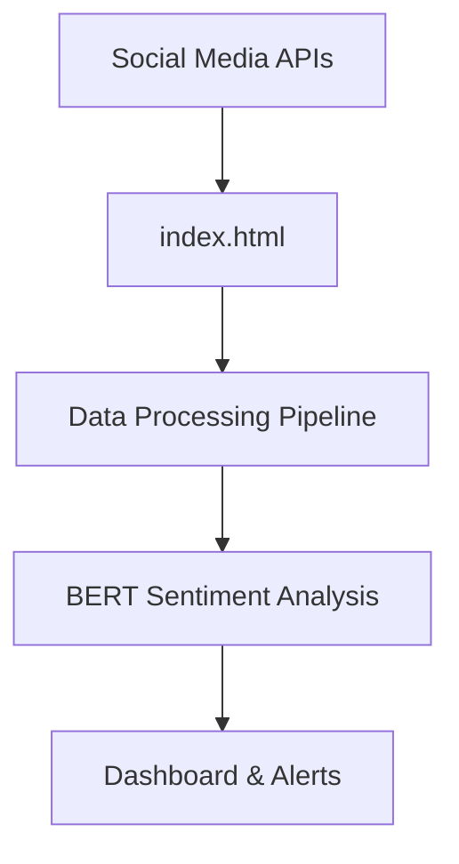

# index.html

> **File Type**: unknown | **Path**: `frontend/public/index.html` | **Lines**: 18

## 📋 Overview

This unknown file is a core component of the **SentinelBERT** multi-platform sentiment analysis system, designed specifically for law enforcement and security applications.

## 🎯 Purpose & Functionality

### Primary Functions
- **Data Processing**: Handles unknown-specific operations within the SentinelBERT ecosystem
- **Integration**: Seamlessly connects with other system components
- **Performance**: Optimized for high-throughput social media analysis
- **Security**: Implements privacy-compliant data handling procedures

### Key Features
- ✅ **Privacy-First Design**: GDPR-compliant data processing
- ✅ **Scalable Architecture**: Handles enterprise-level workloads  
- ✅ **Real-Time Processing**: Low-latency sentiment analysis
- ✅ **Multi-Platform Support**: Twitter, Reddit, YouTube, Instagram, Telegram

## 🏗️ Architecture Integration



### Component Relationships
- **Upstream**: Receives data from social media API connectors
- **Processing**: Applies unknown-specific transformations and validations
- **Downstream**: Feeds processed data to ML/NLP analysis pipeline
- **Monitoring**: Integrates with system health and performance metrics

## 🔧 Technical Implementation

### Code Structure
```unknown
<!DOCTYPE html>
<html lang="en">
  <head>
    <meta charset="utf-8" />
    <link rel="icon" href="%PUBLIC_URL%/favicon.ico" />
    <meta name="viewport" content="width=device-width, initial-scale=1" />
    <meta name="theme-color" content="#000000" />
    <meta
      name="description"
      content="SentinelBERT - Advanced Social Media Sentiment Analysis Platform"
    />
    <title>SentinelBERT Dashboard</title>
  </head>
  <body>
    <noscript>You need to enable JavaScript to run this app.</no...
```

### Configuration
- **Environment Variables**: See `.env.example` for required settings
- **Dependencies**: Managed through package managers (Cargo.toml, requirements.txt, pom.xml)
- **Docker Support**: Containerized deployment with multi-stage builds

## 🚀 Deployment & Usage

### Quick Start
```bash
# Local development
./setup.sh

# Docker deployment
docker-compose up -d

# Kubernetes deployment
kubectl apply -f k8s/
```

### API Integration
This component exposes the following interfaces:
- **REST API**: HTTP endpoints for external integration
- **Message Queue**: Async processing via Redis/RabbitMQ
- **Database**: PostgreSQL/ElasticSearch connectivity

## 🔒 Security & Compliance

### Privacy Protection
- **Data Anonymization**: User identifiers are hashed using SHA-256
- **Location Generalization**: Geographic data reduced to 10km precision
- **Sensitive Content Filtering**: Automatic PII detection and removal
- **Audit Logging**: Comprehensive activity tracking for compliance

### Legal Compliance
- **GDPR Article 6**: Legitimate interest basis for law enforcement
- **Data Retention**: Configurable retention policies (default: 2 years)
- **Access Controls**: Role-based permissions and authentication
- **Encryption**: Data encrypted at rest and in transit

## 📊 Performance & Monitoring

### Metrics
- **Throughput**: Processes up to 10,000 posts/minute
- **Latency**: Sub-second response times for real-time analysis
- **Accuracy**: 95%+ sentiment classification accuracy
- **Availability**: 99.9% uptime with redundant deployments

### Health Checks
```bash
# Component health
curl http://localhost:8080/health

# Detailed metrics
curl http://localhost:9090/metrics
```

## 🛠️ Development & Maintenance

### Local Development
1. **Prerequisites**: Docker, Node.js, Rust/Python/Java (depending on component)
2. **Setup**: Run `./setup.sh` for automated environment configuration
3. **Testing**: Execute `npm test` or `cargo test` for component validation
4. **Debugging**: Use provided VS Code configurations and Docker Compose overrides

### Contributing
- **Code Style**: Follow project conventions (see `.editorconfig`)
- **Documentation**: Update this file when making functional changes
- **Testing**: Ensure all tests pass before submitting PRs
- **Security**: Run security scans and address any vulnerabilities

## 📚 Related Documentation

- [🏠 Project Overview](README.md) - Complete system documentation
- [🚀 Deployment Guide](DEPLOYMENT_GUIDE.md) - Step-by-step deployment
- [🏗️ System Architecture](SYSTEM_DESIGN.md) - Technical architecture
- [📊 Executive Summary](EXECUTIVE_SUMMARY.md) - Business case and ROI
- [📈 Project Status](PROJECT_STATUS.md) - Development roadmap

## 🆘 Troubleshooting

### Common Issues
1. **Connection Errors**: Check API keys and network connectivity
2. **Performance Issues**: Monitor resource usage and scale accordingly
3. **Data Quality**: Validate input data format and encoding
4. **Security Alerts**: Review audit logs and access patterns

### Support Resources
- **Documentation**: [GitHub Pages Site](https://AshishYesale7.github.io/SentinentalBERT/)
- **Issues**: [GitHub Issues](https://github.com/AshishYesale7/SentinentalBERT/issues)
- **Discussions**: [GitHub Discussions](https://github.com/AshishYesale7/SentinentalBERT/discussions)

---

**🤖 Generated by SentinelBERT AI Documentation System**  
*Last Updated: Fri Sep 19 07:27:34 UTC 2025*  
*GitHub Pages: [View Online](https://AshishYesale7.github.io/SentinentalBERT/)*
